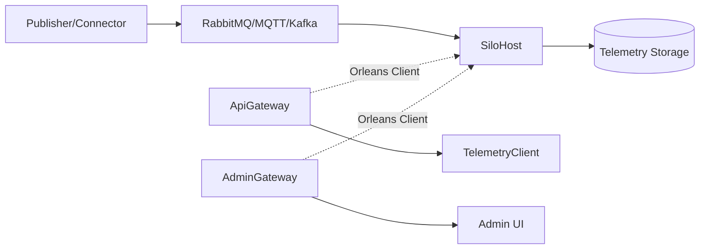

# Building OS using Orleans

Orleans を使ったビルOSの参考実装です。RabbitMQ / Kafka / MQTT Broker / Simulator から受信したメッセージを Grain にルーティングし、最新値を API で参照、履歴を Parquet に保存して検索できます。

## Quick Start

```bash
docker compose up --build
```

起動後の主要 URL:
- Swagger: http://localhost:8080/swagger
- Mock OIDC: http://localhost:8081/default
- Admin UI: http://localhost:8082/
- Telemetry Client: http://localhost:8083/

## System Overview



## Repository Structure

- `src/SiloHost`: Orleans サイロ（ingest / grain / graph seed）
- `src/ApiGateway`: REST/gRPC API
- `src/AdminGateway`: 運用向け管理 UI
- `src/TelemetryClient`: 階層ツリー/ポイント閲覧 UI
- `src/Telemetry.Ingest`: コネクタ/バッチ取り込み
- `src/Telemetry.Storage`: JSONL ステージ + Parquet compaction
- `src/DataModel.Analyzer`: RDF 解析と BuildingDataModel 構築
- `src/Grains.Abstractions`: Grain インターフェースと契約モデル
- `src/Publisher`: サンプルテレメトリー送信

## Documentation Map

概要と導入:
- [PROJECT_OVERVIEW.md](PROJECT_OVERVIEW.md)
- [ローカルセットアップ & オペレーションガイド](docs/local-setup-and-operations.md)

機能別ドキュメント:
- [API Gateway API](docs/api-gateway-apis.md)
- [API Gateway 遠隔制御メモ](docs/api-gateway-remote-control.md)
- [SPARQL クエリ機能](docs/sparql-query-service.md)
- [コネクタ & テレメトリーインジェスト](docs/telemetry-connector-ingest.md)
- [MQTT コネクタ設計](docs/mqtt-connector-design.md)
- [ルーティングと値バインディング](docs/telemetry-routing-binding.md)
- [テレメトリーストレージ](docs/telemetry-storage.md)
- [RDF ロードと Grain 初期化](docs/rdf-loading-and-grains.md)
- [Admin Console](docs/admin-console.md)
- [Telemetry Client Spec](docs/telemetry-client-spec.md)
- [負荷試験ガイド](docs/telemetry-ingest-loadtest.md)
- [OpenTelemetry 運用メモ](docs/observability-opentelemetry.md)
- [Orleans クラスタリングとスケーラビリティ](docs/clustering-and-scalability.md)


## SPARQL Query (API Gateway 経由)

API Gateway には SPARQL 用の REST エンドポイントが追加されています（認証必須）。

- `POST /api/sparql/load`: RDF データをロード
- `POST /api/sparql/query`: SPARQL SELECT/ASK クエリを実行
- `GET /api/sparql/stats`: テナント単位のトリプル数を取得

詳細は [docs/sparql-query-service.md](docs/sparql-query-service.md) を参照してください。

## Build & Test

```bash
dotnet build
dotnet test
```

## IPA スマートビル システムアーキテクチャガイドライン 対応表

以下は **IPA「スマートビル システムアーキテクチャガイドライン」**に記載の *ビルOS機能（4モジュール×機能一覧）* と、**takashikasuya/orleans-telemetry-sample** の実装状況を突き合わせた対応表です。
（評価記号：**◎=満たす / ○=概ね満たす / △=一部のみ / ×=未実装**）

---

### 1) データ送受信モジュール（表5）

| 機能（ガイドライン）     | 必要/推奨 | 実装状況 | 根拠（レポジトリ側）                                                                   | ギャップ/補足                                                    |
| -------------- | ----: | :--: | ---------------------------------------------------------------------------- | ---------------------------------------------------------- |
| デバイス通信（受信）機能   |    必要 |   ◎  | RabbitMQ/Kafka/MQTT/Simulator から受信し、Coordinatorが処理 ([GitHub][1])             | "デバイス"直収というより **メッセージブローカ/コネクタ受信**中心                       |
| データルーティング機能    |    必要 |   ◎  | TelemetryRouterGrain → DeviceGrain へルーティング ([GitHub][2])                     | —                                                          |
| データフィルタリング機能   |    推奨 |   △  | Coordinator/Envelope/Queryで条件処理の余地はあるが、ガイドライン相当のフィルタ機能として明示は弱い ([GitHub][3]) | ルール/品質/異常値除外などの"フィルタリング機能"を仕様化すると良い                        |
| デバイス通信（送信）機能   |    推奨 |   △  | 遠隔制御要求をPointControlGrainへ記録（受付）まで ([GitHub][4])                              | **フィールド層へ実際に送る（egress/publish）**が未実装（docに明記） ([GitHub][4]) |
| 連携GW遠隔アップデート機能 |    推奨 |   ×  | 記載・実装根拠なし                                                                    | —                                                          |
| デバイス認証機能       |    必要 |   △  | アプリ側はJWT/OIDCだが、フィールド層"デバイス認証"としての仕組みは見えにくい ([GitHub][2])                    | mTLS/トークン等で"送信元デバイスの正当性"を担保する設計が必要                         |

> ガイドライン側の機能一覧（表5） ([ipa.go.jp][5])

---

### 2) データ管理モジュール（表6）

| 機能（ガイドライン）    | 必要/推奨 | 実装状況 | 根拠（レポジトリ側）                                               | ギャップ/補足 |
| ------------- | ----: | :--: | -------------------------------------------------------- | ------- |
| リアルタイムデータ管理機能 |    必要 |   ◎  | DeviceGrain が最新値（スナップショット）保持、API/Streamで参照 ([GitHub][2]) | —       |
| アーカイブデータ管理機能  |    推奨 |   ◎  | JSONLステージ→Parquet+Indexへコンパクション、時間範囲等で検索 ([GitHub][6])   | —       |

> ガイドライン側の機能一覧（表6） ([ipa.go.jp][5])

---

### 3) 建物デジタルツインモジュール（表7）

| 機能（ガイドライン）    | 必要/推奨 | 実装状況 | 根拠（レポジトリ側）                                                                 | ギャップ/補足                                 |
| ------------- | ----: | :--: | -------------------------------------------------------------------------- | --------------------------------------- |
| 建物アセットデータ参照機能 |    必要 |   ○  | RDFからGraphNode/GraphIndexを初期化し、RESTでグラフ情報取得。SPARQLエンドポイントも提供 ([GitHub][2]) | "建物アセットデータ"の網羅性（空間/設備/ポイント等）はシードとモデル次第  |
| 建物データモデル管理機能  |    必要 |   ○  | DataModel.Analyzer がRDF解析とBuildingDataModel構築、SHACLテストもあり ([GitHub][2])    | ガイドライン文脈の「モデル管理」（版管理/互換/運用プロセス）はサンプル範囲外 |

> ガイドライン側の機能一覧（表7） ([ipa.go.jp][5])

---

### 4) データ連携モジュール（表8）

| 機能（ガイドライン）   | 必要/推奨 | 実装状況 | 根拠（レポジトリ側）                                                                | ギャップ/補足                                      |
| ------------ | ----: | :--: | ------------------------------------------------------------------------- | -------------------------------------------- |
| データ提供機能      |    必要 |   ◎  | REST APIで最新/履歴、グラフ参照。gRPC（GetSnapshot/StreamUpdates等） ([GitHub][1])       | —                                            |
| 遠隔制御コマンド送信機能 |    推奨 |   △  | APIが制御要求を受付→PointControlGrainへ記録、ルーティング決定まで ([GitHub][4])                 | **フィールド層へ送信する配送実装が未実装**（doc明記） ([GitHub][4]) |
| ブローカー機能      |    推奨 |   △  | 内部はOrleans Streamで更新配信、外部はMQ（RabbitMQ/Kafka/MQTT）は主に"取り込み側" ([GitHub][2]) | ガイドラインの想定する「アプリ間Pub/Sub仲介」用途としては追加設計が必要      |
| アプリケーション認証機能 |    必要 |   ◎  | OIDC/JWT前提（tenant claim解決、mock-oidc同梱） ([GitHub][2])                      | —                                            |
| 権限管理機能       |    必要 |   △  | tenant分離はあるが、権限（RBAC/ABAC）としての詳細は不明確 ([GitHub][2])                        | "誰がどのデータ/制御を実行できるか"のポリシー層が今後                 |

> ガイドライン側の機能一覧（表8） ([ipa.go.jp][5])

---

### 総評（このリポジトリが「ビルOS機能」をどの程度満たすか）

* **強い（◎が多い領域）**：

  * テレメトリ取り込み（受信）・ルーティング
  * リアルタイム管理（Grain）
  * 履歴（Parquet + Index + Query）
  * APIによるデータ提供、OIDC/JWT認証
    ([GitHub][2])
* **弱い/未完（△/×が目立つ領域）**：

  * **遠隔制御の"配送（egress）"**（受付・ルーティング決定はあるが、実送信は未実装） ([GitHub][4])
  * フィールド層デバイス認証、GW遠隔アップデート
  * 権限管理（RBAC/ABAC）とデータフィルタリングの仕様化

---

必要なら次に、上の「△/×」を**ガイドライン準拠に寄せるための追加コンポーネント案**（Control egress、Device identity、Policy/RBAC、Filtering/Quality、Broker設計）を、いまのリポジトリ構造（Telemetry.Ingest / ApiGateway / Grains / Storage）にそのまま差し込む形で設計案に落とします。

[1]: https://raw.githubusercontent.com/takashikasuya/orleans-telemetry-sample/main/README.md "raw.githubusercontent.com"
[2]: https://raw.githubusercontent.com/takashikasuya/orleans-telemetry-sample/main/PROJECT_OVERVIEW.md "raw.githubusercontent.com"
[3]: https://raw.githubusercontent.com/takashikasuya/orleans-telemetry-sample/main/docs/telemetry-connector-ingest.md "raw.githubusercontent.com"
[4]: https://raw.githubusercontent.com/takashikasuya/orleans-telemetry-sample/main/docs/api-gateway-remote-control.md "raw.githubusercontent.com"
[5]: https://www.ipa.go.jp/digital/architecture/Individual-link/ps6vr70000016bq2-att/smartbuilding_system-architecture_guideline.pdf "スマートビルシステムアーキテクチャガイドライン"
[6]: https://raw.githubusercontent.com/takashikasuya/orleans-telemetry-sample/main/docs/telemetry-storage.md "raw.githubusercontent.com"

## Notes

- このリポジトリはローカル検証・学習用途のサンプルです（本番運用向けの堅牢化は未実装）。
- gRPC は `DeviceService`（GetSnapshot/StreamUpdates）と `RegistryService`（タグ検索系）が実装済みです。

## License

MIT License. 詳細は [LICENSE](LICENSE) を参照してください。
