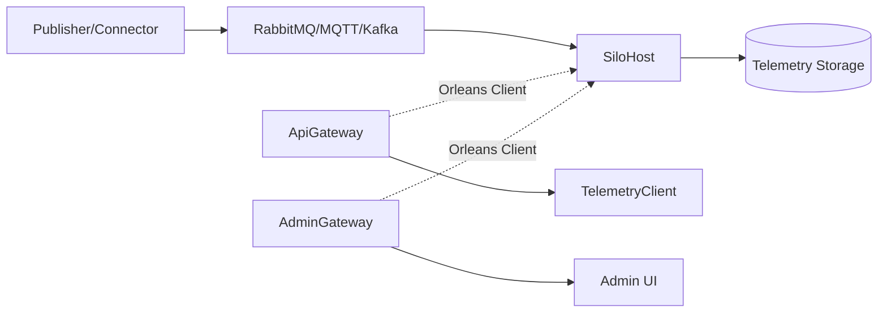

# Building OS using Orleans

Orleans を使ったビルOSの参考実装です。RabbitMQ / Kafka / MQTT Broker / Simulator から受信したメッセージを Grain にルーティングし、最新値を API で参照、履歴を Parquet に保存して検索できます。

## Quick Start

```bash
docker compose up --build
```

起動後の主要 URL:
- Swagger: http://localhost:8080/swagger
- Mock OIDC: http://localhost:8081/default
- Admin UI: http://localhost:8082/
- Telemetry Client: http://localhost:8083/

## System Overview



## Repository Structure

- `src/SiloHost`: Orleans サイロ（ingest / grain / graph seed）
- `src/ApiGateway`: REST/gRPC API
- `src/AdminGateway`: 運用向け管理 UI
- `src/TelemetryClient`: 階層ツリー/ポイント閲覧 UI
- `src/Telemetry.Ingest`: コネクタ/バッチ取り込み
- `src/Telemetry.Storage`: JSONL ステージ + Parquet compaction
- `src/DataModel.Analyzer`: RDF 解析と BuildingDataModel 構築
- `src/Grains.Abstractions`: Grain インターフェースと契約モデル
- `src/Publisher`: サンプルテレメトリー送信

## Documentation Map

概要と導入:
- [PROJECT_OVERVIEW.md](PROJECT_OVERVIEW.md)
- [ローカルセットアップ & オペレーションガイド](docs/local-setup-and-operations.md)

機能別ドキュメント:
- [API Gateway API](docs/api-gateway-apis.md)
- [API Gateway 遠隔制御メモ](docs/api-gateway-remote-control.md)
- [SPARQL クエリ機能](docs/sparql-query-service.md)
- [コネクタ & テレメトリーインジェスト](docs/telemetry-connector-ingest.md)
- [MQTT コネクタ設計](docs/mqtt-connector-design.md)
- [ルーティングと値バインディング](docs/telemetry-routing-binding.md)
- [テレメトリーストレージ](docs/telemetry-storage.md)
- [RDF ロードと Grain 初期化](docs/rdf-loading-and-grains.md)
- [Admin Console](docs/admin-console.md)
- [Telemetry Client Spec](docs/telemetry-client-spec.md)
- [負荷試験ガイド](docs/telemetry-ingest-loadtest.md)
- [OpenTelemetry 運用メモ](docs/observability-opentelemetry.md)
- [Orleans クラスタリングとスケーラビリティ](docs/clustering-and-scalability.md)


## SPARQL Query (API Gateway 経由)

API Gateway には SPARQL 用の REST エンドポイントが追加されています（認証必須）。

- `POST /api/sparql/load`: RDF データをロード
- `POST /api/sparql/query`: SPARQL SELECT/ASK クエリを実行
- `GET /api/sparql/stats`: テナント単位のトリプル数を取得

詳細は [docs/sparql-query-service.md](docs/sparql-query-service.md) を参照してください。

## Build & Test

```bash
dotnet build
dotnet test
```

## Notes

- このリポジトリはローカル検証・学習用途のサンプルです（本番運用向けの堅牢化は未実装）。
- gRPC は `DeviceService`（GetSnapshot/StreamUpdates）と `RegistryService`（タグ検索系）が実装済みです。

## License

MIT License. 詳細は [LICENSE](LICENSE) を参照してください。
