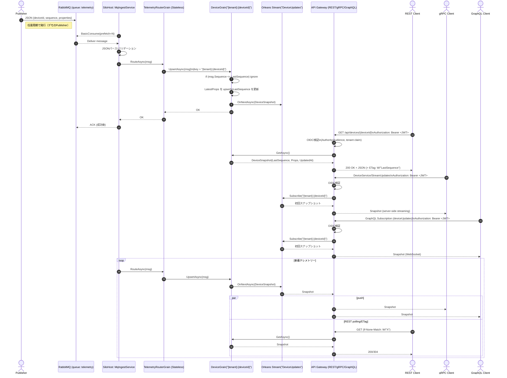

# Orleans Telemetry Sample

This repository contains a minimal sample that demonstrates how to ingest
telemetry messages from RabbitMQ into an Orleans cluster, map them to
device‑scoped grains, and expose the latest state through a REST and gRPC
gateway.  A small publisher service publishes random temperature/humidity
telemetry to RabbitMQ to exercise the pipeline.

## Services

The solution is composed of four Docker services:

| Service        | Description                                                       |
|---------------|-------------------------------------------------------------------|
| `mq`           | RabbitMQ broker used as the message queue for incoming telemetry.|
| `silo`         | Orleans host containing grains and the RabbitMQ consumer.        |
| `api`          | ASP.NET Core application that exposes REST and gRPC endpoints.   |
| `publisher`    | .NET console app that publishes random telemetry to the queue.   |

To run the stack locally you can use Docker Compose:

```bash
docker compose up --build
```

Once running you can navigate to `http://localhost:8080/swagger` to inspect
the REST API and `http://localhost:8080` to call the gRPC service via a client.

This sample is intentionally simple and is not hardened for production use.




