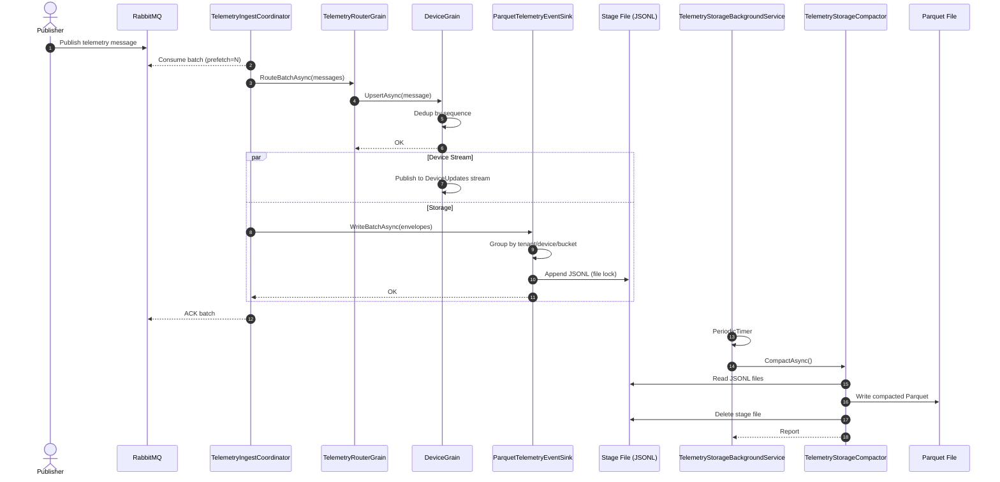
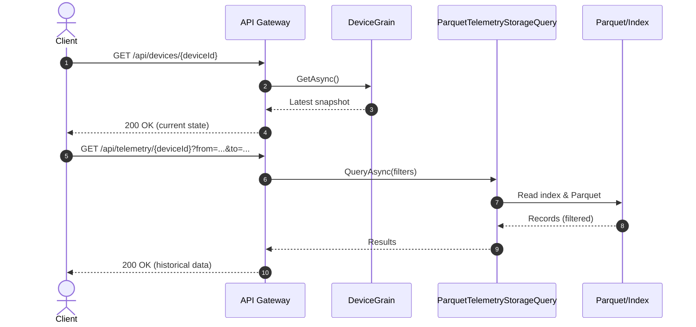
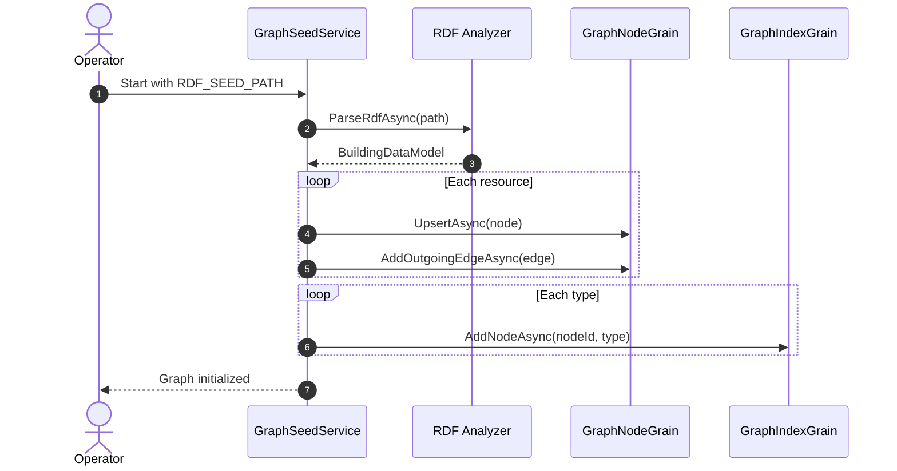
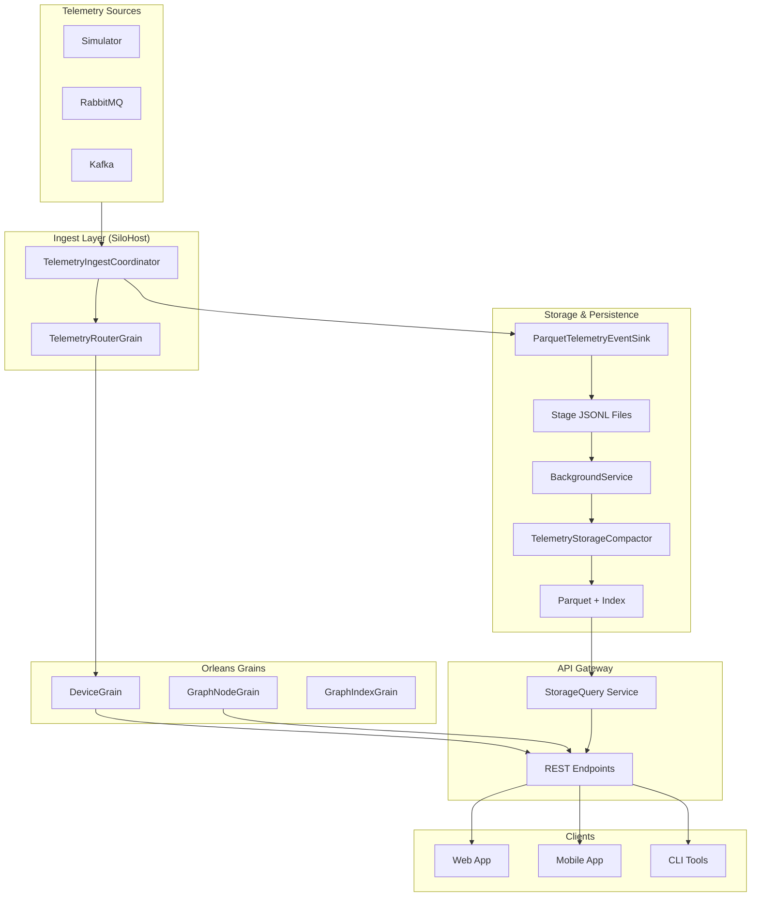

# Orleans Telemetry Sample

A minimal .NET 8 sample demonstrating telemetry ingestion, storage, and graph-based querying using Orleans.
This solution shows how to ingest telemetry from RabbitMQ/Kafka/Simulator, map messages to Orleans grains,
persist events to Parquet, and expose real-time and historical state via REST API.

## Quick Start

### 1. Run with Docker Compose

```bash
docker compose up --build
```

Once running:
- REST Swagger: `http://localhost:8080/swagger`
- Mock OIDC (for tokens): `http://localhost:8081/default`
- Admin console (grain/client/storage health): `http://localhost:8082/`

### 2. Optional: Seed the Graph from RDF

```bash
export RDF_SEED_PATH=/path/to/building-data.ttl
export TENANT_ID=default
docker compose up --build
```

### 3. Try an API Call

```bash
# Get a token from the mock OIDC
TOKEN=$(curl -s -X POST http://localhost:8081/default/token \
  -u "test-client:test-secret" \
  -H "Content-Type: application/x-www-form-urlencoded" \
  -d "grant_type=client_credentials" | jq -r '.access_token')

# Query latest device state
curl -H "Authorization: Bearer $TOKEN" \
  "http://localhost:8080/api/devices/device-1"
```

## Setup & Startup

### Docker Compose (recommended)

```bash
docker compose up --build
```

### Local Development (without Docker)

Start services in separate terminals:

```bash
# 1. Start RabbitMQ first
docker run -d --name rabbitmq -p 5672:5672 -p 15672:15672 rabbitmq:management

# 2. Run Orleans silo
dotnet run --project src/SiloHost

# 3. Run API gateway (in another terminal)
dotnet run --project src/ApiGateway

# 4. Run telemetry publisher (optional, in another terminal)
dotnet run --project src/Publisher
```

### Environment Variables

- **Telemetry Source**
  - `RABBITMQ_HOST`, `RABBITMQ_PORT`, `RABBITMQ_USER`, `RABBITMQ_PASS`
  - `KAFKA_BOOTSTRAP_SERVERS`, `KAFKA_TOPIC`, `KAFKA_GROUP_ID`
- **Authentication**
  - `OIDC_AUTHORITY`, `OIDC_AUDIENCE`
- **Graph Seeding**
  - `RDF_SEED_PATH`: path to RDF file for graph initialization
  - `TENANT_ID`: tenant identifier (default: `default`)

## Core Features

### Telemetry Ingestion

Ingest telemetry from multiple sources:

#### Simulator (built-in)

```json
{
  "TelemetryIngest": {
    "Enabled": [ "Simulator" ],
    "BatchSize": 100,
    "ChannelCapacity": 10000,
    "Simulator": {
      "TenantId": "tenant",
      "BuildingName": "building",
      "SpaceId": "space",
      "DeviceIdPrefix": "sim-",
      "DeviceCount": 2,
      "PointsPerDevice": 3,
      "IntervalMilliseconds": 2000
    }
  }
}
```

#### RabbitMQ

```json
{
  "TelemetryIngest": {
    "Enabled": [ "RabbitMq" ],
    "BatchSize": 100,
    "ChannelCapacity": 10000,
    "RabbitMq": {
      "HostName": "mq",
      "Port": 5672,
      "UserName": "guest",
      "Password": "guest",
      "QueueName": "telemetry",
      "PrefetchCount": 100
    }
  }
}
```

#### Kafka

```json
{
  "TelemetryIngest": {
    "Enabled": [ "Kafka" ],
    "BatchSize": 100,
    "ChannelCapacity": 10000,
    "Kafka": {
      "BootstrapServers": "localhost:9092",
      "GroupId": "telemetry-ingest",
      "Topic": "telemetry",
      "EnableAutoCommit": false,
      "AutoOffsetReset": "Latest",
      "SessionTimeoutMs": 45000,
      "MaxPollIntervalMs": 300000
    }
  }
}
```

### Telemetry Storage

Persist events to disk in two stages:

1. **Stage**: incoming events → JSONL files (bucketed by tenant/device/time)
2. **Compaction**: JSONL → Parquet (background service, periodic)
3. **Query**: efficient Parquet search with index metadata

#### Configuration

```json
{
  "TelemetryStorage": {
    "StagePath": "storage/stage",
    "ParquetPath": "storage/parquet",
    "IndexPath": "storage/index",
    "BucketMinutes": 15,
    "CompactionIntervalSeconds": 300,
    "DefaultQueryLimit": 1000
  },
  "TelemetryIngest": {
    "EventSinks": {
      "Enabled": [ "ParquetStorage" ]
    }
  }
}
```

#### Query Historical Telemetry

```bash
curl -H "Authorization: Bearer $TOKEN" \
  "http://localhost:8080/api/telemetry/device-1?from=2024-01-01T00:00:00Z&to=2024-01-01T23:59:59Z&pointId=p1&limit=100"
```

If the result set is large, the API returns `mode: "url"` with a temporary download link.

Response:
```json
{
  "mode": "inline",
  "count": 1,
  "items": [
    {
      "tenantId": "t1",
      "deviceId": "device-1",
      "pointId": "p1",
      "occurredAt": "2024-01-01T12:34:56Z",
      "sequence": 123,
      "valueJson": "42.5",
      "payloadJson": null,
      "tags": null
    }
  ]
}
```

#### Storage Layout

```
storage/
  stage/
    tenant={tenantId}/device={deviceId}/date=YYYY-MM-DD/hour=HH/telemetry_YYYYMMdd_HHmm.jsonl
  parquet/
    tenant={tenantId}/device={deviceId}/date=YYYY-MM-DD/hour=HH/telemetry_YYYYMMdd_HHmm.parquet
  index/
    tenant={tenantId}/device={deviceId}/date=YYYY-MM-DD/hour=HH/telemetry_YYYYMMdd_HHmm.json
```

#### Key Classes

- [`ParquetTelemetryEventSink`](src/Telemetry.Storage/ParquetTelemetryEventSink.cs): writes stage JSONL
- [`TelemetryStorageCompactor`](src/Telemetry.Storage/TelemetryStorageCompactor.cs): compacts to Parquet + index
- [`ParquetTelemetryStorageQuery`](src/Telemetry.Storage/ParquetTelemetryStorageQuery.cs): reads Parquet
- [`TelemetryStorageBackgroundService`](src/Telemetry.Storage/TelemetryStorageBackgroundService.cs): runs compaction loop
- [`TelemetryStoragePaths`](src/Telemetry.Storage/TelemetryStoragePaths.cs): path utilities
- [`TelemetryStageRecord`](src/Telemetry.Storage/TelemetryStageRecord.cs): JSONL format
- [`TelemetryIndexEntry`](src/Telemetry.Storage/TelemetryIndexEntry.cs): index metadata

### Graph Model (Nodes, Edges, Values)

Query building topology using RDF-based graph model:

- **Nodes**: spaces, devices, points, any custom entity
- **Edges**: relationships (hasArea, contains, measures, etc.)
- **Values**: bind telemetry or custom data to any node

#### API Endpoints

```bash
# Get node metadata and edges
curl -H "Authorization: Bearer $TOKEN" \
  "http://localhost:8080/api/nodes/space-1"

# Get current values bound to a node
curl -H "Authorization: Bearer $TOKEN" \
  "http://localhost:8080/api/nodes/space-1/value"

# Traverse graph (BFS, limited depth)
curl -H "Authorization: Bearer $TOKEN" \
  "http://localhost:8080/api/graph/traverse/building-1?depth=2&predicate=hasArea"
```

#### Seeding from RDF

Pass RDF file path at startup:

```bash
export RDF_SEED_PATH=/path/to/building-data.ttl
export TENANT_ID=default
dotnet run --project src/SiloHost
```

RDF resources become nodes; predicates become edges.

#### Documentation

- [docs/rdf-loading-and-grains.md](docs/rdf-loading-and-grains.md): RDF 読み込みと Orleans Grain 化の概要（データモデル/オントロジー含む）

### Control Flow (Draft)

**Note**: Control interfaces are defined but not fully implemented.

Issue commands to writable points:

```
POST /api/points/{pointId}/control
{
  "commandId": "cmd-123",
  "buildingName": "building",
  "spaceId": "space",
  "deviceId": "device-1",
  "pointId": "setpoint-1",
  "desiredValue": 22.5,
  "metadata": { "source": "operator" }
}
```

Query command status:

```
GET /api/points/{pointId}/control/{commandId}
```

Status follows this state machine: Pending → Accepted → Applied or Rejected.

## Authentication

All REST endpoints require a JWT token with:
- **Issuer**: configured via `OIDC_AUTHORITY`
- **Audience**: configured via `OIDC_AUDIENCE`
- **Claim**: `tenant` (optional; falls back to `t1`)

### Registering clients for API and admin console

1. **API Gateway** – create an OAuth2 client in your identity provider that can mint access tokens with an `aud` value matching `OIDC_AUDIENCE` (default `default`). Configure the provider’s issuer URL into `OIDC_AUTHORITY` and wire `OIDC_AUDIENCE` into the API service (`src/ApiGateway/Program.cs` reads those values directly). The API expects a `tenant` claim in the token (any string is acceptable); include that claim when issuing tokens so that the REST endpoints can route requests to the right tenant.
2. **Admin Console** – the Blazor Server UI in `src/AdminGateway` uses the same middleware, so by default it accepts the same tokens you issue for the API. If you want the console to validate a separate audience you can issue tokens for `ADMIN_AUDIENCE` (the app falls back to `OIDC_AUDIENCE` when `ADMIN_AUDIENCE` is unset). In production, register either the same client or a dedicated client that has access to the admin audience, set `OIDC_AUTHORITY`/`OIDC_AUDIENCE` (and optionally `ADMIN_AUDIENCE`), and ensure the token carries the `tenant` claim. Docker Compose already issues a `test-client:test-secret` credential that works for both services; use the curl snippet below to fetch it and reuse the token against `http://localhost:8080` (API) and `http://localhost:8082` (admin).

### Mock OIDC for Development

Docker Compose includes a mock OIDC server:

```bash
# Get a token
TOKEN=$(curl -s -X POST http://localhost:8081/default/token \
  -u "test-client:test-secret" \
  -H "Content-Type: application/x-www-form-urlencoded" \
  -d "grant_type=client_credentials" | jq -r '.access_token')

# Use in requests
curl -H "Authorization: Bearer $TOKEN" \
  "http://localhost:8080/api/devices"
```

The mock server does **not** validate signatures; for production, configure a real OIDC provider.

## Architecture

### Component Docs

- [コネクタ & テレメトリーインジェスト](docs/telemetry-connector-ingest.md)
- [テレメトリーのルーティングと値バインディング](docs/telemetry-routing-binding.md)
- [テレメトリーストレージ (Parquet)](docs/telemetry-storage.md)

### Services (Docker Compose)

| Service     | Role                                                                  |
|-----------|-----------------------------------------------------------------------|
| `silo`    | Orleans host with grains, ingest, storage, and graph logic.          |
| `api`     | REST/gRPC gateway for querying latest state and history.             |
| `admin`   | Admin console that surfaces grain activations, client counts, ingest, and storage health. |
| `mq`      | RabbitMQ broker for telemetry messages (optional).                   |
| `publisher` | Demo app that publishes random telemetry (optional).               |
| `mock-oidc` | Mock OIDC issuer for local development.                            |

## Admin Console

`AdminGateway` is a dedicated Blazor Server app that runs on its own port (default `8082` in `docker compose`). It exposes the same JWT-protected surface as the REST API, plus four read-only admin endpoints:

```
GET /admin/grains                 → Grain activation counts + silo locations
GET /admin/clients                → Active silo statuses and client counts
GET /admin/storage                → Stage/parquet/index bucket statistics
GET /admin/ingest                 → Configured ingest connectors/event sinks + batch/queue settings
GET /admin/graph/import/status    → Last RDF import summary
POST /admin/graph/import          → Trigger RDF seeding (body: `GraphSeedRequest`)
```

The Blazor UI (served from `/`) delegates to `AdminMetricsService` to render those summaries, and the endpoints can be called from other tools if automation is needed. Authentication relies on the same OIDC configuration (`OIDC_AUTHORITY` / `OIDC_AUDIENCE`) as the API gateway, so the admin console can be locked down with the same tokens.

The “Graph RDF Import” card uses the same RDF parsing pipeline that seeds the graph at silo startup; it shows the last run’s node/edge counts and lets operators re-run the seed against any accessible RDF file/tenant without touching environment variables.

### Key Grain Types

- **`DeviceGrain`**: holds latest telemetry snapshot for a device
- **`TelemetryRouterGrain`**: routes incoming messages to devices
- **`GraphNodeGrain`**: represents a building topology node
- **`GraphIndexGrain`**: indexes nodes by type for traversal

### Ingest Flow

Telemetry → Connector → `TelemetryIngestCoordinator` → Batch → `TelemetryRouterGrain` → `DeviceGrain` → Stream + Storage


## Detailed Sequences & Diagrams

### Telemetry & Storage Flow



### Query Flow (Real-time vs Historical)



### Graph & RDF Seeding



### High-Level Architecture Diagram



## Development & Testing

### Run Tests

```bash
# All tests
dotnet test

# Specific test suite
dotnet test src/DataModel.Analyzer.Tests
dotnet test src/Telemetry.Ingest.Tests
dotnet test src/Telemetry.Storage.Tests
```

### Build

```bash
dotnet build
```

### Local Development Notes

- **Orleans Memory Storage**: SiloHost uses in-memory grain storage (not persisted between restarts)
- **RDF Parsing**: DataModel.Analyzer converts TTL files to Orleans contracts via SHACL validation
- **Schema**: See `src/DataModel.Analyzer/Schema` for SHACL shapes
- **JSON Serialization**: Uses `System.Text.Json` (configured in DataModelExportService)

## Project Structure

```
src/
  SiloHost/                       # Orleans silo & ingest setup
  ApiGateway/                     # REST/gRPC gateway
  DataModel.Analyzer/             # RDF → BuildingDataModel
  Telemetry.Ingest/              # Ingest connectors & coordinator
  Telemetry.Storage/             # Parquet persistence & query
  Grains.Abstractions/           # Grain interfaces & contracts
  Publisher/                      # Demo telemetry publisher
  *Tests/                         # Unit tests
```

## Notes & Limitations

### Current Status

- ✅ Telemetry ingestion (Simulator, RabbitMQ, Kafka)
- ✅ Real-time state in Orleans grains
- ✅ Parquet-based storage & historical queries
- ✅ Graph model (nodes, edges, values) from RDF
- ✅ REST API with JWT authentication
- ⚠️ Control flow (interfaces only, not implemented)
- ⚠️ gRPC service (stubbed)

### Not for Production

This sample is intentionally simple and lacks:
- Data encryption/signing
- Advanced error handling
- Rate limiting
- Audit logging
- Horizontal scaling (Orleans is single-silo)
- Backup/recovery
- Performance optimization

For production, add these hardening steps and consider Orleans clustering, persistent storage, and comprehensive monitoring.

## License

This project is licensed under the **MIT License**.

You are free to use, modify, and distribute this software for any purpose (personal, commercial, etc.) as long as you include a copy of the license and copyright notice.

See [LICENSE](LICENSE) file for details.
