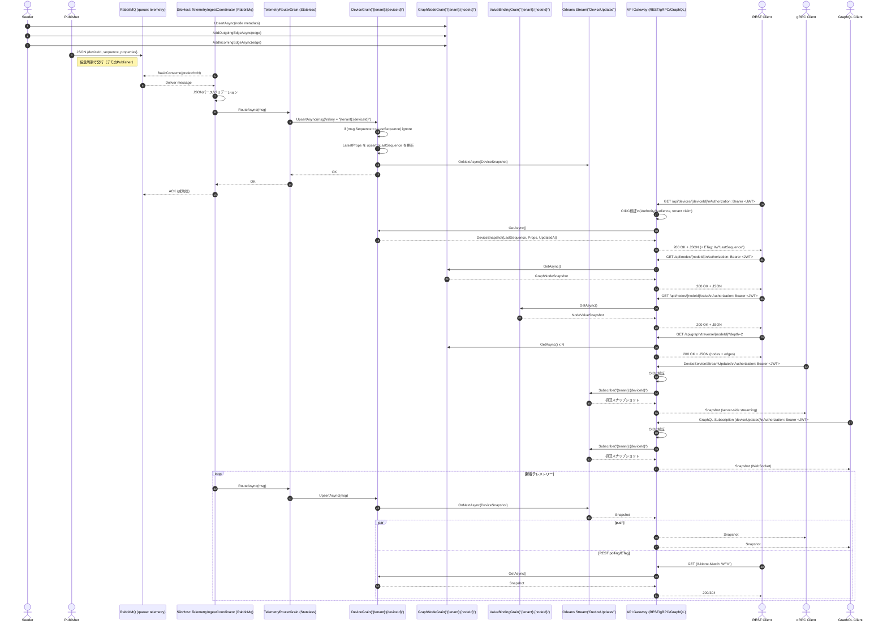
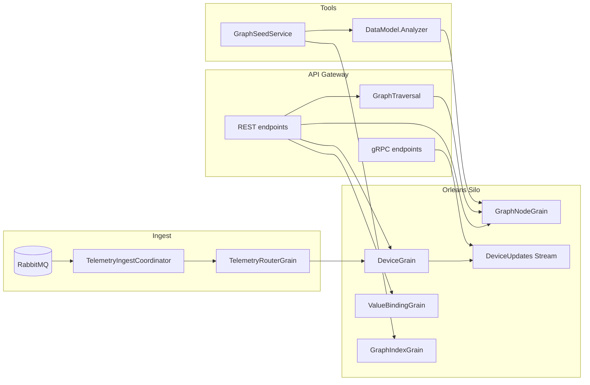

# Orleans Telemetry Sample

This repository contains a minimal sample that demonstrates how to ingest
telemetry messages from RabbitMQ into an Orleans cluster, map them to
device‑scoped grains, and expose the latest state through a REST and gRPC
gateway.  A small publisher service publishes random temperature/humidity
telemetry to RabbitMQ to exercise the pipeline.

## Quick Start

Run the stack with Docker Compose:

```bash
docker compose up --build
```

Once running:
- REST Swagger: `http://localhost:8080/swagger`
- REST base: `http://localhost:8080`

Optional: seed the graph from an RDF file:

```bash
export RDF_SEED_PATH=/path/to/building-data.ttl
export TENANT_ID=default
docker compose up --build
```

## Startup Reference

### Docker Compose (recommended)

```bash
docker compose up --build
```

### Local (without Docker)

Start RabbitMQ, then run each project:

```bash
dotnet run --project src/SiloHost
dotnet run --project src/ApiGateway
dotnet run --project src/Publisher
```

Environment variables:
- `RABBITMQ_HOST`, `RABBITMQ_PORT`, `RABBITMQ_USER`, `RABBITMQ_PASS`
- `RDF_SEED_PATH`: path to RDF file to seed graph nodes/edges on startup
- `TENANT_ID`: tenant key used by graph seeding (default: `default`)

## Graph Model (Nodes, Edges, Values)

The project supports a graph representation of spaces/devices/points based on
`BuildingDataModel`. Each RDF resource becomes a graph node with edges between
them. Any node can also have bound values (not just devices).

Key endpoints (authorized):
- `GET /api/nodes/{nodeId}`: node metadata and edges
- `GET /api/nodes/{nodeId}/value`: latest bound values for a node
- `GET /api/graph/traverse/{nodeId}?depth=2&predicate=hasArea`: graph traversal

## Telemetry Flow

Telemetry messages are routed to device grains and persisted as the latest
state. The graph layer sits alongside this so you can traverse spaces/devices
and bind values to any node.

## Services

The solution is composed of four Docker services:

| Service        | Description                                                       |
|---------------|-------------------------------------------------------------------|
| `mq`           | RabbitMQ broker used as the message queue for incoming telemetry.|
| `silo`         | Orleans host containing grains and the RabbitMQ consumer.        |
| `api`          | ASP.NET Core application that exposes REST and gRPC endpoints.   |
| `publisher`    | .NET console app that publishes random telemetry to the queue.   |

To run the stack locally you can use Docker Compose:

```bash
docker compose up --build
```

Once running you can navigate to `http://localhost:8080/swagger` to inspect
the REST API and `http://localhost:8080` to call the gRPC service via a client.

This sample is intentionally simple and is not hardened for production use.

## Telemetry ingest connectors

Telemetry ingestion is handled by `Telemetry.Ingest` and can enable multiple connectors
via configuration. To run with the built-in simulator:

```json
{
  "TelemetryIngest": {
    "Enabled": [ "Simulator" ],
    "BatchSize": 100,
    "ChannelCapacity": 10000,
    "Simulator": {
      "TenantId": "tenant",
      "BuildingName": "building",
      "SpaceId": "space",
      "DeviceIdPrefix": "sim-",
      "DeviceCount": 2,
      "PointsPerDevice": 3,
      "IntervalMilliseconds": 2000
    }
  }
}
```






