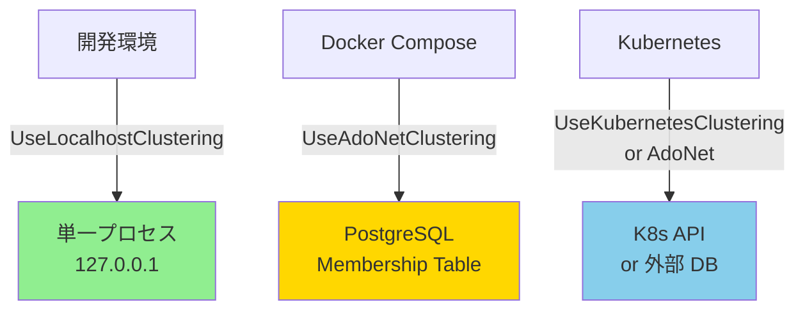
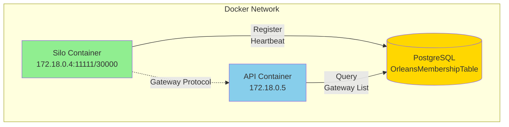

# Orleans Clustering and Scalability

本ドキュメントでは、orleans-telemetry-sample プロジェクトにおける分散化戦略、Orleans クラスタリングの設定、およびスケーラビリティへのアプローチについて説明します。

## Table of Contents

- [Overview](#overview)
- [Clustering Requirements by Environment](#clustering-requirements-by-environment)
- [Development Environment](#development-environment)
- [Docker Compose Environment](#docker-compose-environment)
- [Production and Kubernetes](#production-and-kubernetes)
- [Implementation Guide: AdoNet Clustering](#implementation-guide-adonet-clustering)
- [Troubleshooting](#troubleshooting)
- [Related Documentation](#related-documentation)

---

## Overview

### なぜクラスタリング設定が重要なのか

Orleans は分散アクターフレームワークであり、複数の Silo（サーバーノード）が協調して動作するために **Membership Protocol** を使用します。このプロトコルでは以下の情報を管理します：

- **Cluster Membership**: どの Silo がクラスターに参加しているか
- **Gateway List**: Client がどのエンドポイントに接続できるか
- **Health Status**: 各 Silo の状態（Active/Dead/Joining）

適切なクラスタリング設定がないと：
- ❌ Client が Silo に接続できない（Connection Refused）
- ❌ Silo が自己接続を試みてエラー（InvalidOperationException）
- ❌ コンテナ間通信が失敗（Docker/Kubernetes 環境）

### 本プロジェクトのアプローチ



**戦略**:
- 🟢 **開発環境**: シンプルさ優先（DB 不要）
- 🟡 **Docker Compose**: コンテナ間通信対応（PostgreSQL 活用）
- 🔵 **Kubernetes**: 本番環境対応（自動スケーリング）

---

## Clustering Requirements by Environment

| 環境 | Clustering 方式 | Membership Provider | 理由 |
|------|-----------------|---------------------|------|
| **ローカル開発**<br/>(Visual Studio/CLI) | `UseLocalhostClustering()` | In-Memory | - 単一マシン上の単一プロセス<br/>- 127.0.0.1 で完結<br/>- DB 不要でシンプル |
| **Docker Compose**<br/>(複数コンテナ) | `UseAdoNetClustering()` | PostgreSQL/MySQL | - 各コンテナは異なるネットワーク空間<br/>- DB で Membership を共有<br/>- プロダクション移行可能 |
| **Kubernetes**<br/>(本番環境) | `UseKubernetesClustering()`<br/>または `UseAdoNetClustering()` | K8s API<br/>または DB | - Pod の自動スケーリング対応<br/>- Service Discovery<br/>- 動的なメンバー変更 |

---

## Development Environment

### 設定方法

**Program.cs (SiloHost)**:
```csharp
builder.UseOrleans((context, siloBuilder) =>
{
    var orleansSection = context.Configuration.GetSection("Orleans");
    var advertisedHost = orleansSection["AdvertisedIPAddress"];

    if (string.IsNullOrWhiteSpace(advertisedHost))
    {
        // ローカル開発: localhost clustering
        siloBuilder.UseLocalhostClustering(
            siloPort: orleansSection.GetValue("SiloPort", 11111),
            gatewayPort: orleansSection.GetValue("GatewayPort", 30000)
        );
    }
    else
    {
        // Docker/Production: 別の設定（後述）
    }
    
    siloBuilder.Configure<ClusterOptions>(options =>
    {
        options.ClusterId = "telemetry-cluster";
        options.ServiceId = "telemetry-service";
    });
});
```

**特徴**:
- すべて `127.0.0.1` でバインド
- Membership Table は in-memory
- 追加のインフラ不要

**制約**:
- 単一プロセスのみ（複数 Silo 不可）
- 他のマシン/コンテナから接続不可

### 起動方法

```bash
# SiloHost
cd src/SiloHost
dotnet run

# ApiGateway (別ターミナル)
cd src/ApiGateway
dotnet run
```

---

## Docker Compose Environment

### 問題: なぜ UseLocalhostClustering は動作しないのか

Docker 環境では各コンテナが独立したネットワーク空間を持ちます：

```
┌─────────────────────────────────────────┐
│  Docker Network (172.18.0.0/16)         │
│                                          │
│  ┌────────────────┐  ┌────────────────┐ │
│  │ silo container │  │ api container  │ │
│  │ IP: 172.18.0.4 │  │ IP: 172.18.0.5 │ │
│  │                │  │                │ │
│  │ Listen:        │  │ Try connect:   │ │
│  │ 127.0.0.1:30000│◄─│ silo:30000     │ │
│  │ (localhost)    │  │ (172.18.0.4)   │ │
│  └────────────────┘  └────────────────┘ │
│         ✗ Connection Refused             │
└─────────────────────────────────────────┘
```

**問題点**:
- `UseLocalhostClustering` は `127.0.0.1` にバインド
- API コンテナから `silo:30000` (実際は `172.18.0.4:30000`) にアクセスしようとする
- Silo は自身のコンテナ内の `127.0.0.1` でしかリッスンしていない
- → **Connection Refused** エラー

### 解決策: AdoNet Clustering

PostgreSQL を Membership Table として使用することで、すべてのコンテナが DB 経由で互いを発見できます。

#### アーキテクチャ



#### Membership Table の内容

```sql
-- OrleansMembershipTable (例)
DeploymentId      | Address      | Port  | Status | ProxyPort | IAmAliveTime
------------------|--------------|-------|--------|-----------|-------------
telemetry-cluster | 172.18.0.4   | 11111 | 0      | 30000     | 2026-02-14 12:34:56
```

**動作**:
1. Silo 起動時: DB に自身の IP/Port を登録
2. API 起動時: DB から Gateway リスト取得 → `172.18.0.4:30000` に接続
3. Silo は定期的に `IAmAliveTime` を更新（Heartbeat）

### 現状のステータス

⚠️ **現在、Docker E2E テストは無効化されています**

**理由**: AdoNet Clustering がまだ実装されていないため

**影響**:
- `./scripts/run-e2e.sh` は in-proc テストのみ実行
- Docker ベースのテストはスキップされる（コメントアウト）

**次のステップ**: [Implementation Guide](#implementation-guide-adonet-clustering) 参照

---

## Production and Kubernetes

### Kubernetes Clustering

Kubernetes 環境では、Pod の動的なスケーリングに対応する必要があります。

#### Option A: Kubernetes Native Clustering

```csharp
siloBuilder.UseKubernetesClustering(options =>
{
    options.Namespace = "default";
    options.Group = "orleans-cluster";
});
```

**メリット**:
- Kubernetes API で Pod を自動発見
- StatefulSet/Deployment との統合が容易
- 外部 DB 不要

**要件**:
- ServiceAccount で K8s API へのアクセス権限
- 適切な RBAC 設定
- Pod に Label/Annotation でグループ指定

#### Option B: AdoNet Clustering (推奨)

```csharp
siloBuilder.UseAdoNetClustering(options =>
{
    options.ConnectionString = Environment.GetEnvironmentVariable("ORLEANS_DB_CONNECTION");
    options.Invariant = "Npgsql";
});
```

**メリット**:
- Docker Compose と同じ設定が使える
- マルチクラスター構成が可能（複数 K8s クラスター間で共有）
- Kubernetes 依存なし（他のオーケストレーターでも動作）

**デメリット**:
- 外部 DB が必要（Cloud SQL, RDS など）

### その他のオプション

- **Redis Clustering**: 軽量だが、Redis サーバーが必要
- **Consul Clustering**: Service Discovery 機能が豊富だが、複雑
- **Azure Storage Clustering**: Azure 環境専用

---

## Implementation Guide: AdoNet Clustering

### Step 1: NuGet パッケージ追加

**SiloHost.csproj**:
```xml
<ItemGroup>
  <PackageReference Include="Microsoft.Orleans.Clustering.AdoNet" Version="8.2.0" />
  <PackageReference Include="Npgsql" Version="8.0.5" />
</ItemGroup>
```

**ApiGateway.csproj**:
```xml
<ItemGroup>
  <PackageReference Include="Microsoft.Orleans.Clustering.AdoNet" Version="8.2.0" />
  <PackageReference Include="Npgsql" Version="8.0.5" />
</ItemGroup>
```

### Step 2: PostgreSQL コンテナ追加

**docker-compose.yml**:
```yaml
services:
  orleans-db:
    image: postgres:15
    environment:
      POSTGRES_DB: orleans
      POSTGRES_USER: orleans
      POSTGRES_PASSWORD: orleans_dev_password
    ports:
      - "5432:5432"
    volumes:
      - orleans-db-data:/var/lib/postgresql/data
      - ./scripts/init-orleans-db.sql:/docker-entrypoint-initdb.d/init.sql
    healthcheck:
      test: ["CMD-SHELL", "pg_isready -U orleans"]
      interval: 5s
      timeout: 3s
      retries: 20

  silo:
    depends_on:
      orleans-db:
        condition: service_healthy
    environment:
      Orleans__Clustering: "AdoNet"
      Orleans__AdoNet__ConnectionString: "Host=orleans-db;Database=orleans;Username=orleans;Password=orleans_dev_password"
      # 既存の環境変数...

  api:
    depends_on:
      orleans-db:
        condition: service_healthy
    environment:
      Orleans__Clustering: "AdoNet"
      Orleans__AdoNet__ConnectionString: "Host=orleans-db;Database=orleans;Username=orleans;Password=orleans_dev_password"
      # 既存の環境変数...

volumes:
  orleans-db-data:
```

### Step 3: DB スキーマ初期化

**scripts/init-orleans-db.sql**:

Orleans 公式の SQL スクリプトを使用します：
- [PostgreSQL Schema](https://github.com/dotnet/orleans/blob/main/src/AdoNet/Shared/PostgreSQL-Clustering.sql)

```bash
# スクリプトダウンロード
curl -o scripts/init-orleans-db.sql \
  https://raw.githubusercontent.com/dotnet/orleans/main/src/AdoNet/Shared/PostgreSQL-Clustering.sql
```

### Step 4: Program.cs 更新

**SiloHost/Program.cs**:
```csharp
builder.UseOrleans((context, siloBuilder) =>
{
    var orleansSection = context.Configuration.GetSection("Orleans");
    var clusteringMode = orleansSection["Clustering"];
    var siloPort = orleansSection.GetValue("SiloPort", 11111);
    var gatewayPort = orleansSection.GetValue("GatewayPort", 30000);

    if (clusteringMode == "AdoNet")
    {
        // AdoNet Clustering (Docker/Production)
        var connectionString = orleansSection["AdoNet:ConnectionString"];
        siloBuilder.UseAdoNetClustering(options =>
        {
            options.ConnectionString = connectionString;
            options.Invariant = "Npgsql";
        });

        // AdvertisedIPAddress を設定（Docker コンテナ名など）
        var advertisedHost = orleansSection["AdvertisedIPAddress"];
        if (!string.IsNullOrWhiteSpace(advertisedHost))
        {
            if (IPAddress.TryParse(advertisedHost, out var parsedIp))
            {
                siloBuilder.Configure<EndpointOptions>(options =>
                {
                    options.AdvertisedIPAddress = parsedIp;
                    options.SiloPort = siloPort;
                    options.GatewayPort = gatewayPort;
                    options.SiloListeningEndpoint = new IPEndPoint(IPAddress.Any, siloPort);
                    options.GatewayListeningEndpoint = new IPEndPoint(IPAddress.Any, gatewayPort);
                });
            }
            else
            {
                // Hostname の場合は DNS 解決
                var addresses = Dns.GetHostAddresses(advertisedHost);
                var ipv4 = addresses.FirstOrDefault(ip => ip.AddressFamily == System.Net.Sockets.AddressFamily.InterNetwork);
                if (ipv4 != null)
                {
                    siloBuilder.Configure<EndpointOptions>(options =>
                    {
                        options.AdvertisedIPAddress = ipv4;
                        options.SiloPort = siloPort;
                        options.GatewayPort = gatewayPort;
                        options.SiloListeningEndpoint = new IPEndPoint(IPAddress.Any, siloPort);
                        options.GatewayListeningEndpoint = new IPEndPoint(IPAddress.Any, gatewayPort);
                    });
                }
            }
        }
    }
    else
    {
        // Localhost Clustering (開発環境)
        siloBuilder.UseLocalhostClustering(siloPort: siloPort, gatewayPort: gatewayPort);
    }
    
    siloBuilder.Configure<ClusterOptions>(options =>
    {
        options.ClusterId = "telemetry-cluster";
        options.ServiceId = "telemetry-service";
    });
    
    // 既存の Grain Storage 設定など...
});
```

**ApiGateway/Program.cs**:
```csharp
builder.UseOrleansClient((context, clientBuilder) =>
{
    var orleansSection = context.Configuration.GetSection("Orleans");
    var clusteringMode = orleansSection["Clustering"];

    if (clusteringMode == "AdoNet")
    {
        var connectionString = orleansSection["AdoNet:ConnectionString"];
        clientBuilder.UseAdoNetClustering(options =>
        {
            options.ConnectionString = connectionString;
            options.Invariant = "Npgsql";
        });
    }
    else
    {
        var gatewayHost = orleansSection["GatewayHost"] ?? "localhost";
        var gatewayPort = orleansSection.GetValue("GatewayPort", 30000);
        clientBuilder.UseLocalhostClustering(gatewayPort: gatewayPort);
    }
    
    clientBuilder.Configure<ClusterOptions>(options =>
    {
        options.ClusterId = "telemetry-cluster";
        options.ServiceId = "telemetry-service";
    });
});
```

### Step 5: 動作確認

```bash
# ビルド
dotnet build

# Docker Compose 起動
docker compose up --build

# Silo ログで確認
docker compose logs silo | grep -i "membership"
# 期待: "Joined cluster" や DB 接続成功メッセージ

# API ログで確認
docker compose logs api | grep -i "gateway"
# 期待: "Found '1' gateways" メッセージ

# Swagger でテスト
curl http://localhost:8080/api/health
```

### Step 6: E2E テスト再有効化

**scripts/run-e2e.sh**:
```bash
run_inproc
run_docker  # コメントアウトを解除
```

```bash
./scripts/run-all-tests.sh
# 期待: E2E テスト (Docker) が成功
```

---

## Troubleshooting

### 問題: "Unable to connect to endpoint" エラー

**症状**:
```
Orleans.Runtime.Messaging.ConnectionFailedException: 
Unable to connect to endpoint S172.18.0.4:30000:0. 
Error: ConnectionRefused
```

**原因**:
- Silo が `127.0.0.1` にしかバインドしていない
- API が Docker ネットワーク IP でアクセスしようとしている

**解決策**:
1. `AdvertisedIPAddress` 環境変数を確認
2. `EndpointOptions.SiloListeningEndpoint` が `IPAddress.Any` になっているか確認
3. AdoNet Clustering を使用する

### 問題: "Unexpected connection id" エラー

**症状**:
```
System.InvalidOperationException: 
Unexpected connection id sys.silo/01111111-1111-1111-1111-111111111111 
on proxy endpoint
```

**原因**:
- `UseDevelopmentClustering` で Primary Silo として自己登録
- Gateway が同じノードの Silo に Silo-to-Silo プロトコルで接続

**解決策**:
- AdoNet Clustering に移行する
- `UseDevelopmentClustering` は使用しない

### 問題: PostgreSQL 接続エラー

**症状**:
```
Npgsql.NpgsqlException: Connection refused
```

**確認項目**:
1. PostgreSQL コンテナが起動しているか
   ```bash
   docker compose ps orleans-db
   ```
2. Connection String が正しいか
   ```bash
   docker compose logs silo | grep "ConnectionString"
   ```
3. Healthcheck が成功しているか
   ```bash
   docker compose ps --format json | jq '.[] | select(.Service=="orleans-db") | .Health'
   ```

**解決策**:
- `depends_on` で `service_healthy` 条件を設定
- DB 初期化スクリプトが正しく実行されているか確認

### 問題: E2E テストが Docker でタイムアウト

**症状**:
```
[04:28:52] Waiting for API
API did not become ready in time
```

**確認項目**:
1. Silo が正常起動しているか
   ```bash
   docker compose logs silo | grep "Started silo"
   ```
2. API が Silo に接続できているか
   ```bash
   docker compose logs api | grep "gateway"
   ```

**解決策**:
- AdoNet Clustering が正しく設定されているか確認
- タイムアウト時間を延長（開発環境では遅い場合がある）

---

## Related Documentation

- [Orleans Clustering Documentation](https://learn.microsoft.com/en-us/dotnet/orleans/host/configuration-guide/clustering)
- [AdoNet Clustering Provider](https://learn.microsoft.com/en-us/dotnet/orleans/host/configuration-guide/adonet-clustering)
- [Kubernetes Hosting](https://learn.microsoft.com/en-us/dotnet/orleans/deployment/kubernetes)
- [PROJECT_OVERVIEW.md](../PROJECT_OVERVIEW.md) - システム全体のアーキテクチャ
- [local-setup-and-operations.md](local-setup-and-operations.md) - 開発環境セットアップ
- [plans.md](../plans.md) - Orleans Clustering Strategy セクション

---

## Summary

| 環境 | 推奨設定 | 実装状況 |
|------|---------|---------|
| **ローカル開発** | `UseLocalhostClustering()` | ✅ 実装済み |
| **Docker Compose** | `UseAdoNetClustering()` | ⚠️ 要実装 |
| **Kubernetes** | `UseKubernetesClustering()`<br/>または `UseAdoNetClustering()` | 📝 将来対応 |

**Next Steps**:
1. PostgreSQL コンテナ追加
2. DB スキーマ初期化
3. NuGet パッケージ追加
4. Program.cs 更新
5. E2E テスト検証

詳細な実装記録は [plans.md](../plans.md) を参照してください。
