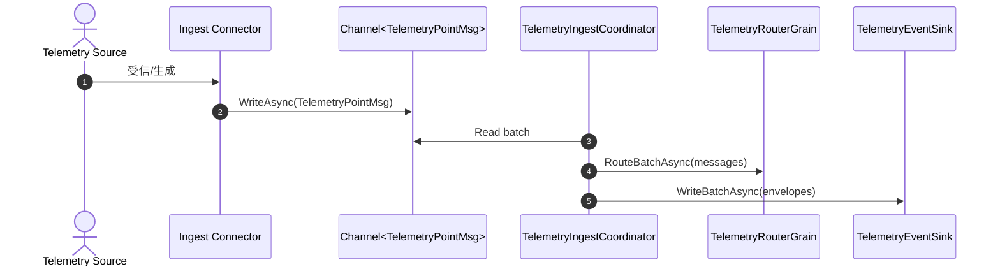
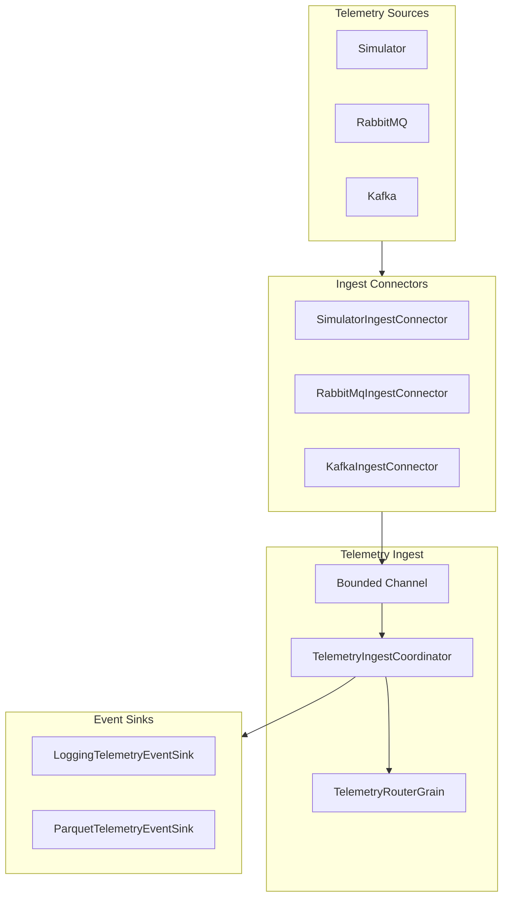

# コネクタ & テレメトリーインジェスト概要

このページでは、コネクタとテレメトリーインジェストの構成要素を整理し、処理の流れや拡張方法をまとめます。
オーケストレーションは `TelemetryIngestCoordinator` が担い、コネクタから受け取ったメッセージをチャネルでバッファし、バッチ単位でルータとイベントシンクへ渡します。`TelemetryPointMsg` を受けるコネクタと、`TelemetryEventEnvelope` を受けるイベントシンクが疎結合になっているのがポイントです。【F:src/Telemetry.Ingest/TelemetryIngestCoordinator.cs†L10-L188】【F:src/Grains.Abstractions/DeviceContracts.cs†L102-L128】【F:src/Telemetry.Ingest/EventEnvelope.cs†L1-L30】

## 処理手順

1. **コネクタ起動**: `ITelemetryIngestConnector.StartAsync` で外部ソース（Simulator/RabbitMQ/Kafka）から `TelemetryPointMsg` を生成し、チャネルへ書き込みます。【F:src/Telemetry.Ingest/ITelemetryIngestConnector.cs†L1-L10】
2. **チャネル受信 & バッチ化**: `TelemetryIngestCoordinator` がチャネルから読み取り、`BatchSize` 単位でまとめます。【F:src/Telemetry.Ingest/TelemetryIngestCoordinator.cs†L71-L129】
3. **ルーティング**: `TelemetryRouterGrain` へバッチを渡し、ポイント単位の Grain に分配します。【F:src/Telemetry.Ingest/TelemetryIngestCoordinator.cs†L94-L129】
4. **イベントシンク書き込み**: `TelemetryEventEnvelopeFactory` が `TelemetryPointMsg` を `TelemetryEventEnvelope` に変換し、イベントシンクへ書き込みます。【F:src/Telemetry.Ingest/TelemetryIngestCoordinator.cs†L149-L188】【F:src/Telemetry.Ingest/TelemetryEventEnvelopeFactory.cs†L1-L26】
5. **ストレージ永続化（例）**: `ParquetTelemetryEventSink` がステージ JSONL を書き込み、バックグラウンドで Parquet へコンパクションされます。【F:src/Telemetry.Storage/ParquetTelemetryEventSink.cs†L1-L146】

## テレメトリースキーマ

### TelemetryPointMsg（コネクタ → インジェスト）

コネクタがチャネルへ書き込むメッセージ形式です。【F:src/Grains.Abstractions/DeviceContracts.cs†L102-L128】

| フィールド | 型 | 内容 |
| --- | --- | --- |
| TenantId | string | テナント識別子 |
| BuildingName | string | 建物名 |
| SpaceId | string | 空間名/ゾーン |
| DeviceId | string | デバイス ID |
| PointId | string | ポイント ID |
| Sequence | long | デバイス内の連番（重複排除に利用） |
| Timestamp | DateTimeOffset | 測定時刻 |
| Value | object? | テレメトリー値 |

### TelemetryEventEnvelope（インジェスト → イベントシンク）

インジェスト側がストレージ/ログ用に変換するメッセージです。基本的に `TelemetryPointMsg` をラップし、インジェスト時刻やイベント種別を付与します。【F:src/Telemetry.Ingest/EventEnvelope.cs†L1-L30】【F:src/Telemetry.Ingest/TelemetryEventEnvelopeFactory.cs†L1-L26】

| フィールド | 型 | 内容 |
| --- | --- | --- |
| TenantId/BuildingName/SpaceId/DeviceId/PointId | string | 位置・デバイス識別子 |
| Sequence | long | 連番 |
| OccurredAt | DateTimeOffset | 取得時刻（`Timestamp`） |
| IngestedAt | DateTimeOffset | インジェスト時刻 |
| EventType | enum | 例: Telemetry/Log/Control |
| Severity | enum? | ログイベントの重要度（Telemetry では null） |
| Value | object? | テレメトリー値 |
| Payload | JsonDocument? | 拡張ペイロード |
| Tags | IDictionary<string,string>? | タグ |

## コネクタ拡張方法

1. **`ITelemetryIngestConnector` 実装**
   - `Name` を定義し、`StartAsync` で `ChannelWriter<TelemetryPointMsg>` へ書き込みます。【F:src/Telemetry.Ingest/ITelemetryIngestConnector.cs†L1-L10】
2. **DI への登録**
   - `SiloHost` でコネクタを登録し、`TelemetryIngest` の設定で有効化します（Kafka/RabbitMQ/Simulator の登録パターンを参照）。【F:src/SiloHost/Program.cs†L17-L44】
3. **設定スキーマの追加**
   - 既存の `TelemetryIngest` 設定のセクションに、新しいコネクタの設定を追加します（`appsettings.json` の `TelemetryIngest` セクションを参考）。【F:src/SiloHost/appsettings.json†L1-L38】

> 補足: コネクタ登録はコードで行い、どのコネクタを起動するかは `TelemetryIngest:Enabled` で制御されます。【F:src/SiloHost/Program.cs†L31-L44】【F:src/Telemetry.Ingest/TelemetryIngestCoordinator.cs†L39-L70】

## 負荷試験

インジェストのバックプレッシャー/バッチ設定検証には `Telemetry.Ingest.LoadTest` プロジェクトを使います。既定で複数ステージ（baseline/ramp/overload）を実行し、Markdown と JSON のレポートを `reports/` に出力します。【F:src/Telemetry.Ingest.LoadTest/Program.cs†L15-L120】

```bash
# 既定シナリオ
dotnet run --project src/Telemetry.Ingest.LoadTest

# 短縮シナリオ（--quick）
dotnet run --project src/Telemetry.Ingest.LoadTest -- --quick

# バッチサイズのスイープ
dotnet run --project src/Telemetry.Ingest.LoadTest -- --batch-sweep
```

## シーケンス図（コネクタ → インジェスト → ストレージ）



## コンポーネント図（コネクタ & インジェスト）


