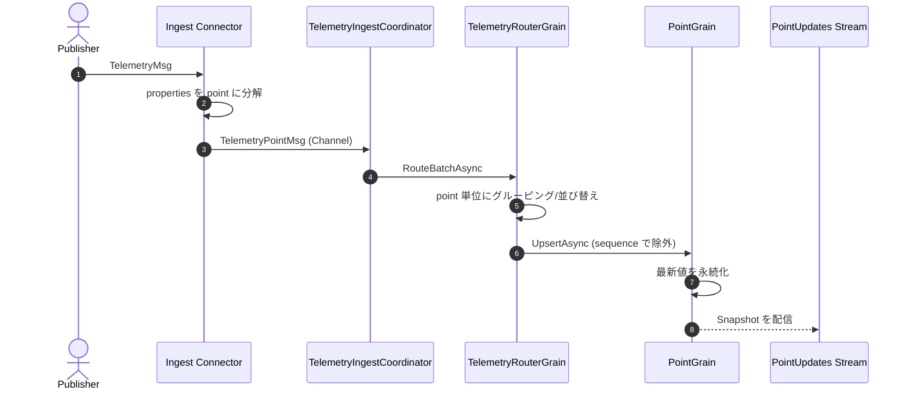
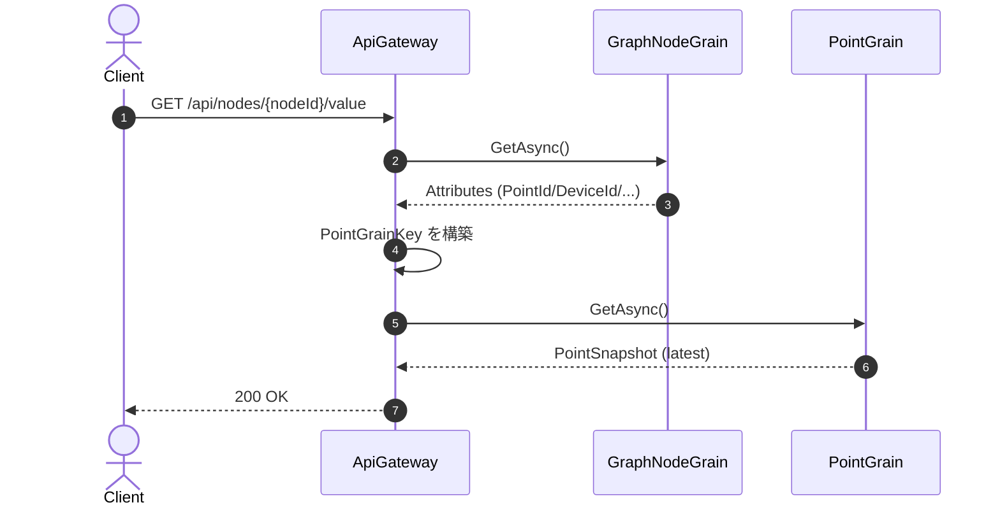

# テレメトリーのルーティングと値バインディング

このドキュメントは、テレメトリーのインジェスト後にどの Grain へルーティングされ、
Graph ノードにどう値がバインディングされるかをまとめたものです。
あわせて、利用しているライブラリ/考え方と、シーケンス/コンポーネント図を示します。

## 目的と全体像

- **インジェスト後の主処理**は「ポイント単位の Grain へ順序保証しながら配送する」ことです。
- **値バインディング**は「Graph ノードが保持する属性を使って PointGrain を参照し、最新値を取得する」流れです。

## 主要なライブラリと考え方

- **Orleans**: Grain による状態管理、永続化、ストリーム配信。
- **System.Threading.Channels**: コネクタ → coordinator 間のバッファ/バックプレッシャ。
- **RabbitMQ/Kafka コネクタ**: 受信した `TelemetryMsg` をポイント単位に展開して送信。
- **ステートは Grain へ集約**: PointGrain が「最新値」を保持し、重複/遅延をシーケンスで排除。

## ルーティングの流れ

1. コネクタが `TelemetryMsg` を受信し、`Properties` をポイント単位に分解して `TelemetryPointMsg` として投入。
2. `TelemetryIngestCoordinator` が `Channel` から読み取り、バッチで `TelemetryRouterGrain` に渡す。
3. `TelemetryRouterGrain` は **Point 単位でグルーピング**し、`PointGrain` へ順序付けして `UpsertAsync`。
4. `PointGrain` は **LastSequence を更新**し、最新値を永続化。必要に応じてストリーム配信。

### シーケンス図（インジェスト → ルーティング）



## Grain キーの組み立て

- **PointGrainKey**: `{tenant}:{building}:{space}:{device}:{point}` で識別し、パーツ内の `:` は `_` に正規化。
- **GraphNodeKey**: `{tenant}:{nodeId}` で GraphNodeGrain を識別。
- **DeviceGrainKey**: `{tenant}:{deviceId}` でデバイス単位の Grain を識別（API で参照）。

## 値バインディングの流れ

Graph ノード側の属性が **PointGrain の参照キー**を持ち、API がその情報を使って値を取得します。

- Graph ノードは `GraphNodeGrain` に保存され、`Attributes` に `PointId` / `DeviceId` / `BuildingName` / `SpaceId` が入る想定。
- `/api/nodes/{nodeId}/value` は `GraphNodeGrain` を取得し、属性から `PointGrainKey` を組み立て、
  `PointGrain` の最新値を返します。
- **ValueBindingGrain** は「ノード単位の値ストア」として用意されています（現在の API では直接使用していません）。

### シーケンス図（Graph ノード → 値取得）



## コンポーネント図

```mermaid
flowchart TB
    subgraph Ingest[Telemetry Ingest]
        Conn[Ingest Connectors]
        Coord[TelemetryIngestCoordinator]
        Router[TelemetryRouterGrain]
    end

    subgraph Grains[Orleans Grains]
        Point[PointGrain]
        Node[GraphNodeGrain]
        Value[ValueBindingGrain]
        Device[DeviceGrain]
    end

    subgraph API[ApiGateway]
        NodeApi[/nodes/{nodeId}/value]
        DeviceApi[/devices/{deviceId}]
    end

    Conn --> Coord --> Router --> Point
    NodeApi --> Node --> Point
    DeviceApi --> Device
    Value -. optional .-> Node
```

## 補足

- PointGrain は **point 単位の最終値**を保持する設計です。
- DeviceGrain は **device 単位のスナップショット取得**に利用されます（API から参照）。
- GraphNodeGrain と PointGrain のバインディングは、**Graph ノードの属性**で表現しています。

