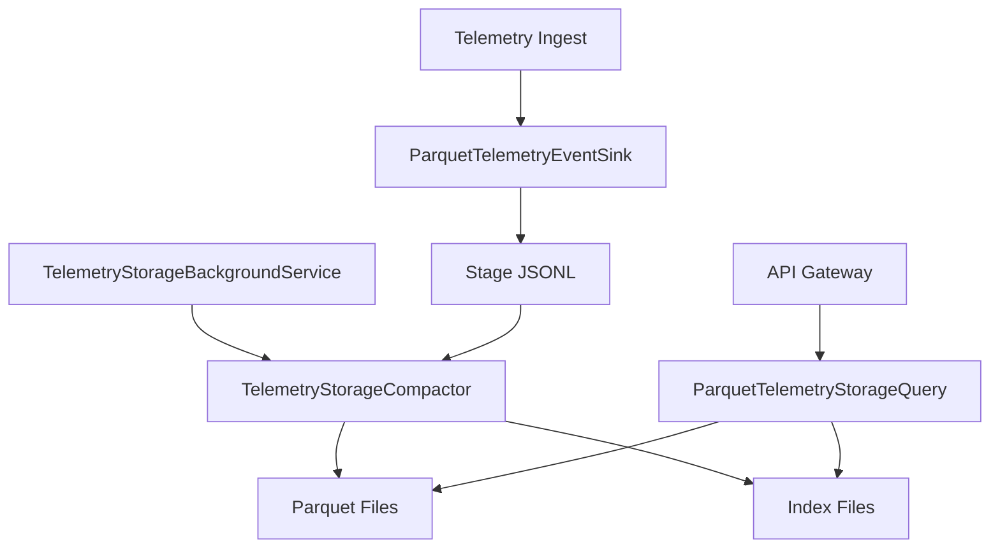
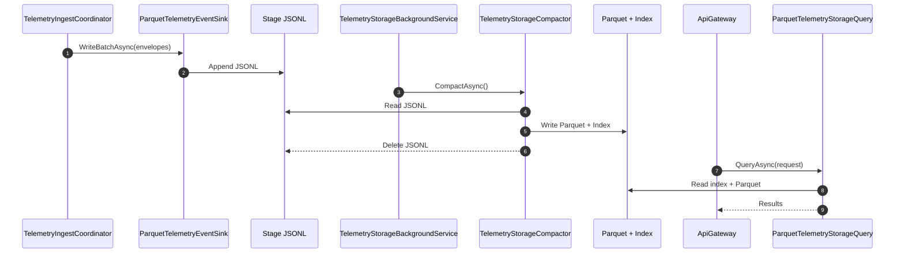

# テレメトリーストレージ (Parquet)

このドキュメントは `Telemetry.Storage` モジュールの責務と、Parquet 永続化のテスト方針をまとめたものです。

## 概要

`Telemetry.Storage` はインジェストされたイベントを以下の 2 段階で永続化します。

1. **ステージ (JSONL)**: `ParquetTelemetryEventSink` がイベントを JSONL へ追記
2. **コンパクション (Parquet)**: `TelemetryStorageCompactor` が Parquet + インデックスへ変換

クエリ側は `ParquetTelemetryStorageQuery` が Parquet を読み取り、`TelemetryQueryRequest` の条件でフィルタします。

## 設計思想 (サイドカーアーキテクチャ)

`Telemetry.Storage` はインジェスト経路の主要処理から I/O を分離する「サイドカー的」な構成です。

- **疎結合**: インジェストは `ITelemetryEventSink` に書き込むだけで、Parquet 変換は別責務に分離
- **遅延書き込み**: JSONL へ追記して即時応答し、重い Parquet 化はバックグラウンドで実施
- **故障分離**: コンパクションの失敗はインジェストの即時処理に影響させない
- **回復容易性**: JSONL が「未コンパクションのキュー」として残り、再実行で回復可能

## 採用技術

- **Parquet.NET**: Parquet 書き込み/読み込み
- **System.Text.Json**: JSONL とインデックスのシリアライズ
- **BackgroundService / PeriodicTimer**: 定期的なコンパクション
- **Microsoft.Extensions.Options**: ストレージ設定の注入

## アーキテクチャ (データフロー)

```
Ingest -> ParquetTelemetryEventSink -> Stage JSONL
                                   -> TelemetryStorageCompactor -> Parquet + Index
API Query -> ParquetTelemetryStorageQuery -> Parquet + Index
```

- バケットは `BucketMinutes` 単位で切り、`tenant/device/date/hour` 配下に保存
- インデックスは `Min/Max OccurredAt` と `PointIds` を保持し、クエリ前フィルタに利用

## コンポーネント図



## シーケンス図



## 拡張の仕方

- **別ストレージの追加**: `ITelemetryEventSink` を実装し、`TelemetryIngest:EventSinks:Enabled` で有効化
- **Parquet スキーマ拡張**: `TelemetryStageRecord` と `TelemetryStorageCompactor.WriteParquetAsync` を更新
- **インデックス強化**: `TelemetryIndexEntry` に列を追加し、`WriteIndexAsync`/`ReadIndexAsync` を拡張
- **クエリ条件の拡張**: `TelemetryQueryRequest` と `ParquetTelemetryStorageQuery` のフィルタを追加
- **運用チューニング**: `BucketMinutes` と `CompactionIntervalSeconds` を調整

## 主要コンポーネント

- `ParquetTelemetryEventSink` : ステージファイル (JSONL) への追記とバケット分割
- `TelemetryStorageCompactor` : JSONL から Parquet とインデックスを生成
- `ParquetTelemetryStorageQuery` : Parquet を走査して履歴テレメトリーを返却
- `TelemetryStorageBackgroundService` : 定期的なコンパクションの実行
- `TelemetryStoragePaths` : バケット/ファイルパスの組み立てと解析
- `TelemetryStageRecord` : JSONL の 1 行フォーマット

## ファイルレイアウト

```
storage/
  stage/
    tenant={tenantId}/device={deviceId}/date=YYYY-MM-DD/hour=HH/telemetry_YYYYMMdd_HHmm.jsonl
  parquet/
    tenant={tenantId}/device={deviceId}/date=YYYY-MM-DD/hour=HH/telemetry_YYYYMMdd_HHmm.parquet
  index/
    tenant={tenantId}/device={deviceId}/date=YYYY-MM-DD/hour=HH/telemetry_YYYYMMdd_HHmm.json
```

## テスト方針 (Telemetry.Storage.Tests)

Parquet への保存が成立していることを、以下の観点で検証します。

- **ステージ書き込み**: `ParquetTelemetryEventSink` が JSONL を作成する
- **コンパクション**: `TelemetryStorageCompactor` が Parquet とインデックスを生成する
- **クエリ**: `ParquetTelemetryStorageQuery` が PointId と時間帯で正しくフィルタする

既存のテスト実装は `ParquetTelemetryStorageTests` に集約されています。

## テスト実行

```bash
# ストレージ系のみ

dotnet test src/Telemetry.Storage.Tests
```

## 関連設計

- BigQuery 追加時の設計案: [telemetry-storage-bigquery-design.md](telemetry-storage-bigquery-design.md)
